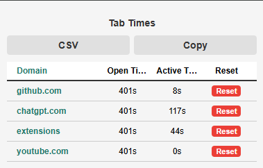

# Tab Time Tracker Chrome Extension

**Track how long your tabs have been open and active in real time, with a badge and detailed popup interface.**  

---

## Features

- **Real-time tab tracking:**  
  - Tracks how long each tab has been **open** and **active**.  
  - Active time only counts when the tab is focused in its window.  

- **Badge display:**  
  - Shows **open time** only:  
    - Tabs under 1 hour: `MM:SS`  
    - Tabs over 1 hour: `H:MM`  
  - Updates every second automatically.  
  - Badge color changes for long-running tabs (over 1 hour).  

- **Popup interface:**  
  - Lists all open tabs in a **table layout** with a **header row**.  
  - Columns: **Domain**, **Open Time**, **Active Time**, **Reset button**.  
  - Tabs are sorted by creation time to maintain a stable order.  
  - Click a domain to **focus/activate that tab**.  
  - **Copy** button copies tab times (with open/active seconds) to clipboard.  
  - **CSV** button downloads tab times as a CSV file.  
  - Modern card-style design with hover effects for rows.  

- **Example Popup:**  

---

## Installation Instructions

1. **Download or clone the repository**  
   Ensure you have all the files:  
   - `manifest.json`  
   - `background.js`  
   - `popup.html`  
   - `popup.js`  

2. **Open Chrome extensions page**  
   Navigate to: `chrome://extensions/`

3. **Enable Developer Mode**  
   Toggle the switch in the top-right corner.

4. **Load the extension**  
   - Click **Load unpacked**  
   - Select the folder containing the extension files.

5. **Pin the extension (optional)**  
   - Click the puzzle icon in the toolbar  
   - Pin “Tab Time Tracker” for easy access.

6. **Use the extension**  
   - Open multiple tabs.  
   - The badge shows **open time** per tab.  
   - Click the extension icon to open the popup for detailed open/active times.  
   - Use **Copy** or **CSV** buttons for exporting tab data.  

---

## How it Works

- **Background Script (`background.js`)**  
  - Tracks tab creation and removal.  
  - Updates **open time** for all tabs every second.  
  - Updates **active time** only when tab is focused.  
  - Updates tab badge dynamically (MM:SS or H:MM for open time).  
  - Handles popup requests (get tab times, focus tab, reset timer, copy/CSV).  

- **Popup (`popup.html` + `popup.js`)**  
  - Displays all tabs in a **table layout**.  
  - Shows **Domain**, **Open Time**, **Active Time**, **Reset button**.  
  - Sorted by `createdAt` to maintain order.  
  - Stylish hover effects, responsive layout.  
  - **Copy** button copies tab info to clipboard.  
  - **CSV** button downloads tab info for external use.  

---

## Development Notes

- Compatible with **Chrome Manifest V3**.  
- Badge text limited to 4 characters: MM:SS or H:MM.  
- Tab times persist during the session; optional storage via `chrome.storage.local`.  
- Works with inactive tabs and background windows.  

---

## Future Enhancements

- Customize **badge colors or popup theme**.  
- Add more **sorting/filtering options** in the popup.  
- Include **tab group support** for better organization.  

---

## License

This extension is open source. Feel free to modify and use it as needed.
